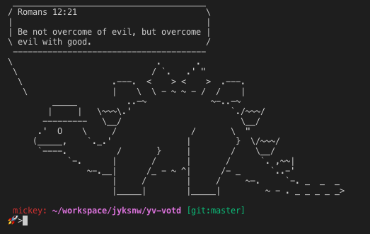

# YouVersion VOTD CLI

A command line interface (CLI) to fetch the current verse of the day from [YouVersion](https://www.youversion.com) public votd [API](https://developers.youversion.com)

The YouVersion VOTD CLI has been developed using the [Go programming language](https://golang.org) and currently requires to be installed from source. If go has been installed than than installation is as easy as:

```bash
go get -u github.com/jyksnw/yv-votd
go install github.com/jyksnw/yv-votd
```

There are two environment variable that must be set prior to running the YouVersion VOTD CLI:

| Variable  |    |
|---|---|
| YOUVERSION_VOTD_TOKEN   |   Your YouVersion Developer Token|
| YOUVERSION_VOTD_VERSION |   The YouVersion Bible Version ID|

A YouVersion Developer Token can be obtained by creating an account on the [YouVersion Developer Portal](https://developers.youversion.com)

The YouVersion Bible Version ID can be obtains by calling the [YouVersion Versions API](https://yv-public-api-docs.netlify.com/api/versions.html). If the `YOUVERSION_VOTD_VERSION` environment variable is not set than a default of 1 will be used which maps to the KJV.

The YouVersion VOTD CLI caches each day's verse of the day in a dated file found in the `$GOPATH/bin/.votd`. For example, if the YouVersion VOTD CLI was executed for the first time on 10/30/2018 the resulting response would be cached in the file `$GOPATH/bin/.votd/20181030`

## TODO

- [ ] Add support to pass in command line arguments
- [ ] Fail back to prior votd on error
- [ ] Add support to fetch supported versions and their Id's
- [ ] Add support for converting VOTD image to ASCII art

## Example Usage

The YouVersion VOTD CLI could be used to print the current version of the day the terminal window by setting up your `.bashrc` or `.bash_profile` with the following (assuming that the `$GOPATH/bin` directory is on your `$PATH`):

```bash
export YOUVERSION_VOTD_TOKEN={your_developer_token}
export YOUVERSION_VOTD_VERSION=1 #KJV
yv-votd | cowsay -f stegosaurus
```

